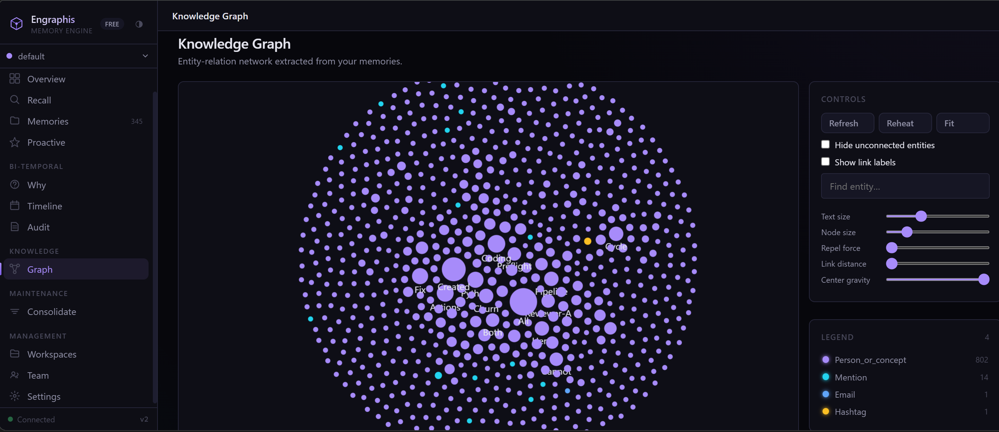

# Engraphis

**Give your AI agents a memory. See it, search it, and watch it self-maintain — all in a beautiful WebUI on your own machine.**

<br>

<p align="center">
  
  <br>
  <sup>Knowledge Graph · run <code>engraphis-dashboard</code> to see it live</sup>
</p>

<br>

---

## The WebUI — one command, local-first

```bash
pip install "engraphis[server]"
engraphis-dashboard
```

Opens `http://127.0.0.1:8700` in your browser. No cloud, no signup, no API key for memory.
Everything lives in a single SQLite file on your machine.

**You'll see the full product** — a dark-themed, sidebar-navigated dashboard with 11 tabs:

| Tab | What you see |
|-----|-------------|
| **Overview** | Live memory counts, retention distribution, weekly growth, decay forecast, resolver action mix, most-connected entities |
| **Memories** | Browse every memory by workspace, sorted by retention — click into a full reader with retention/stability pills |
| **Recall** | Search across the entire memory bank — each result shows its score breakdown (retention, semantic, lexical, graph, importance, recency) |
| **Knowledge Graph** | Interactive D3 force-directed graph of entities and their relationships — click any node to see every linked memory |
| **Timeline** | Chronological feed of every memory event — creation, invalidation, correction, consolidation |
| **Consolidate** | Run a consolidation sweep on demand — see what got distilled and what got pruned |
| **Audit** | Full governance ledger — who did what, when, and why |
| **Settings** | Database stats, license activation (Pro/Team), and system health |
| **Chat** | Ask questions against your memory — the LLM answers grounded in context |
| **Vaults** | Manage workspace vaults — create, rename, delete, bulk import |
| **Import** | Drag & drop or paste markdown files to populate your knowledge base |

The dashboard is powered by the v2 engine — the same `MemoryService` that backs the MCP server
and the Python library. What you see in the UI is what your agents get.

### Start it on every platform

| Platform | How |
|----------|-----|
| **Windows** | Double-click **Engraphis Dashboard** on your Desktop or Start Menu (install: `engraphis-dashboard --install-shortcuts`) |
| **macOS** | Double-click **Engraphis Dashboard.app** on your Desktop (install: same command) |
| **Linux** | Desktop entry in Applications → Development (GNOME/KDE/etc.) |
| **Any** | `engraphis-dashboard` in a terminal |

### Also ships with the Memory Inspector

For a focused, accessibility-first view of individual memories and their history:

```bash
engraphis-inspector
```

Opens `http://127.0.0.1:8710` with:
- Search by query with score breakdown
- **Supersession-chain view with word-level diffs** — see exactly when a fact changed and why
- Why/timeline/link browsing, proactive recall, consolidation, audit trail
- Keyboard-navigable, ARIA-annotated, light/dark mode via `prefers-color-scheme`

---

## What's under the UI

Your agents forget everything between sessions. Engraphis fixes that — on your machine. Every new
session, your coding agent starts from zero: re-asking which package manager you use, re-learning
the codebase, forgetting why you chose PASETO over JWT. Engraphis gives agents durable, scoped,
*explainable* memory.

Under the hood: Ebbinghaus forgetting-curve decay, interaction-aware reinforcement, bi-temporal
facts, and hybrid (vector + lexical + graph) recall. The engine is 100% local: SQLite + local
embeddings. You bring the LLM only for optional chat/synthesis.

- **Local-first & private** — runs offline; the core depends only on `numpy`.
- **MCP-native** — 18 tools for Claude Code, Cursor, Cline, Zed, Windsurf.
- **Self-maintaining facts** — writes are deterministically conflict-resolved (no LLM required).
- **Principled recall** — six-term score over retention, semantic, lexical, graph, importance, recency.
- **Bi-temporal truth** — contradictions invalidate instead of overwriting (`engraphis_why` / `engraphis_timeline`).
- **Grounded, not guessed** — cited answers or explicit abstain; provenance on every memory.
- **Code-aware** — AST-powered symbol graph: `engraphis_index_repo` → `engraphis_search_code`.
- **Sleep-time consolidation** — scheduled job distills recurring episodes, reports its compaction.
- **Scoped** — `workspace → repo → session` hierarchy.

---

## Why it wins

| Axis | Neocortex | mem0 | Zep | Engraphis |
|---|---|---|---|---|
| Product WebUI (local, no cloud) | ✗ | ✗ | ✗ | **✓ (dashboard + Inspector)** |
| Open & self-hostable engine | ✗ | ✓ | partial | **✓ fully open, local-first** |
| Forgetting/decay | ✓ | partial | ✗ | **✓** |
| Bi-temporal graph | ✗ | partial | ✓ | **✓** |
| Native multi-repo model | ✗ | ✗ | ✗ | **✓ (unique)** |
| Code-aware (AST/symbol graph) | ✗ | ✗ | ✗ | **✓ (unique)** |
| MCP-native for coding agents | ✗ | ✓ | ✗ | **✓** |

---

## Install

```bash
pip install "engraphis[all]"    # dashboard + MCP server + code graph + everything
pip install "engraphis[server]" # dashboard + REST API
pip install "engraphis[mcp]"    # MCP server only
pip install engraphis           # core library — numpy only, fully offline
```

> First run downloads `all-MiniLM-L6-v2` (~80 MB). Without it, the engine falls back
> to a deterministic offline embedder so it always runs.

---

## Quickstart — dashboard (the headline)

```bash
pip install "engraphis[server]"
engraphis-dashboard                   # → http://127.0.0.1:8700
engraphis-dashboard --install-shortcuts   # → Desktop + Start Menu icons
```

---

## Quickstart — MCP server (for coding agents)

```bash
pip install "engraphis[mcp]"
engraphis-init                     # writes .env + prints config snippets
claude mcp add engraphis -- engraphis-mcp
```

Your agent now has 18 tools — remember, recall (grounded + proactive), why, timeline,
forget, pin, correct, ingest, consolidate, index_repo, search_code, link, record_event,
start/end_session, stats. See the [MCP tools table](#mcp-tools) below.

---

## Quickstart — Python library

```python
from engraphis.service import MemoryService

mem = MemoryService.create("engraphis.db")
mem.remember("Auth migrated from JWT to PASETO.", workspace="acme", repo="api")
hit = mem.recall("why did we change auth?", workspace="acme", repo="api")
print(hit["context"])
```

The same `MemoryService` backs the dashboard, the Inspector, and the MCP server.

---

## Free forever vs. Pro

The engine, dashboard, Inspector, MCP server, and governance tools are free and Apache-2.0,
permanently. A license key (verified **offline** — no phone-home) unlocks the paid layer.

> **⚠️ Pro and Team are coming soon — not available for purchase yet.** Features below
> are built and gated but keys are not sold today. Do not pay anyone for an Engraphis license
> right now. Prices are targets, not live.

| | Free (available now) | Pro — coming soon | Team — coming soon |
|---|---|---|---|
| Dashboard WebUI + Inspector | ✓ | ✓ | ✓ |
| Memory engine + 18 MCP tools | ✓ | ✓ | ✓ |
| Analytics dashboard (growth, retention, decay forecast) | | ✓ | ✓ |
| Compliance export (full bi-temporal JSON dump) | | ✓ | ✓ |
| Multi-user Inspector: logins, roles, seat management | | | ✓ |
| Analytics HTML report export (self-contained, shareable) | | | ✓ |
| Priority support | | ✓ | ✓ |

---

## MCP tools

| Category | Tool | What it does |
|---|---|---|
| Write | `engraphis_remember` | Store a fact; deterministically resolved (add/reinforce/supersede) |
| Write | `engraphis_record_event` | Append a lightweight episodic log entry |
| Write | `engraphis_link` | Explicitly connect two related memories |
| Read | `engraphis_recall` | Hybrid vector + lexical + graph recall |
| Read | `engraphis_recall_grounded` | Cited answer from retrieved memories — or abstain |
| Read | `engraphis_recall_proactive` | "What should I know right now" — no query needed |
| Read | `engraphis_why` | Current answer + what it superseded |
| Read | `engraphis_timeline` | Full bi-temporal history, oldest first |
| Code | `engraphis_index_repo` | Parse a repo into the code symbol graph |
| Code | `engraphis_search_code` | Find symbols by name, with callers |
| Governance | `engraphis_forget` | Retire a memory — bi-temporal close, never deleted |
| Governance | `engraphis_pin` | Exempt from future automatic decay/pruning |
| Governance | `engraphis_correct` | Replace content without losing history |
| Session | `engraphis_start_session` / `engraphis_end_session` | Session lifecycle with cross-session handoff |
| Ops | `engraphis_stats` | Memory counts for health checks |

---

## Configuration

All via environment (or `.env`):

| Env Var | Default | Description |
|---------|---------|-------------|
| `ENGRAPHIS_DB_PATH` | `./engraphis.db` | SQLite database file |
| `ENGRAPHIS_HOST` | `127.0.0.1` | Server bind address |
| `ENGRAPHIS_PORT` | `8700` | Dashboard port |
| `ENGRAPHIS_API_TOKEN` | — | If set, REST API requires `Authorization: Bearer <token>` |
| `ENGRAPHIS_EMBED_MODEL` | `all-MiniLM-L6-v2` | sentence-transformers model |
| `ENGRAPHIS_LLM_PROVIDER` | `openai` | `openai \| anthropic \| google \| openrouter` |
| `ENGRAPHIS_LLM_API_KEY` | — | LLM API key (only for chat/synthesis) |
| `ENGRAPHIS_LICENSE_KEY` | — | Pro/Team key (or `~/.engraphis/license.key`) |

See `.env.example` for the full list.

---

## Project structure

```
engraphis/
├── engraphis/
│   ├── core/                # v2 engine — interfaces, store, recall, scoring, schema
│   ├── backends/            # pluggable embedder / vector index / reranker / codegraph
│   ├── service.py           # validated MemoryService facade
│   ├── mcp_server.py        # MCP server — 18 tools
│   ├── dashboard_app.py     # dashboard WebUI (FastAPI)
│   ├── config.py / app.py   # env settings / REST server
│   └── static/              # dashboard frontend
├── eval/                    # offline retrieval eval harness + datasets
├── tests/                   # pytest suite (offline, numpy-only core)
├── scripts/                 # start_dashboard, inspector, cli, init, consolidate
├── Dockerfile / docker-compose.yml
└── pyproject.toml
```

---

## Development

The offline quality gate (no network, no API key):

```bash
pip install numpy pytest ruff
python -m pytest tests/ -q
python -m eval.harness --dataset eval/datasets/sample.jsonl --k 5
python -m eval.harness --dataset eval/datasets/codemem.jsonl --k 5
python -m eval.ablation
ruff check .
```

Numbers, not assertions: the offline harness is a **correctness floor** (deterministic embedder).
LoCoMo / LongMemEval competitive numbers run separately with a real embedder — see
[`BENCHMARKS.md`](BENCHMARKS.md).

---

## License

Apache-2.0 — see [LICENSE](LICENSE) and [NOTICE](NOTICE). "Engraphis" is a trademark of the
Engraphis project; the license does not grant trademark rights.
