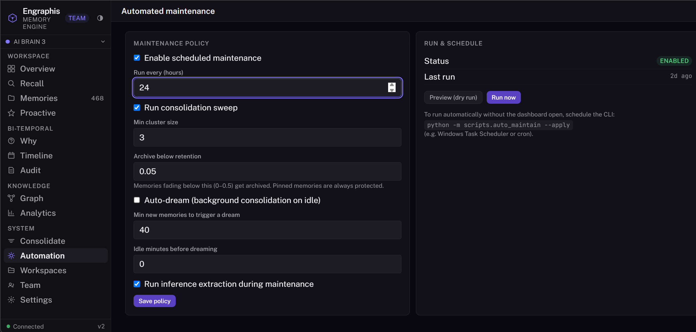

# Engraphis

[](https://github.com/Coding-Dev-Tools/engraphis)
[](https://github.com/Coding-Dev-Tools/engraphis/blob/main/LICENSE)
[](https://buymeacoffee.com/Jaixii)

https://engraphis.com/

https://discord.com/invite/Wfr2ejBmY

**Give your AI agents a memory. See it, search it, and watch it self-maintain — all in a beautiful WebUI on your own machine.**

<br>

<p align="center">
  
  <br>
  <sup>Knowledge Graph · run <code>engraphis-dashboard</code> to see it live</sup>
</p>

<br>

---

> Open-source users: update regularly for the latest fixes and improvements.
>
> **Version 1.0:** the core engine, dashboard, MCP server, Pro features, and Team layer
> are generally available. Team includes multi-user authentication, roles, seat management,
> invitation and password-reset flows, audit history, and scoped cloud-sync tokens.

## The WebUI — one command, local-first

```bash
pip install "engraphis[server]"
engraphis-dashboard
```

Opens `http://127.0.0.1:8700` in your browser. No cloud, no signup, no API key for memory.
Memory lives in a local SQLite file on your machine. When hosted user accounts are enabled,
their credentials and sessions live in a companion `<database>.users.db`; back up both files.

**You'll see the full product** — a dark-themed (with multiple theme options in left sidebar), sidebar-navigated dashboard with 14 tabs:

**New graphical interface!** Shape the Knowledge Graph with several **Styles, Colors,
and Presets**. Switch among Cyberpunk, Galaxy, Solar system, and Classic looks; choose
a color palette and layout preset; or change the colors used for each type of node.

| Tab | What you see |
|-----|-------------|
| **Overview** | Live memory counts, memory-type mix, and a health summary at a glance |
| **Analytics** *(Pro)* | Growth, retention distribution, decay forecast, resolver mix, and top entities — plus a one-click shareable HTML report and a cross-workspace portfolio view |
| **Recall** | Hybrid search across the memory bank — each result shows its score breakdown (retention, semantic, lexical, graph, importance, recency) |
| **Memories** | Browse and curate every memory by workspace — click into a full reader with type and retention pills, drag-to-reorder, inline title/type edits |
| **Proactive** | "What should I know right now" — importance × recency × retention, plus the last session handoff |
| **Why** | The current answer to a question, and the facts it superseded |
| **Timeline** | Bi-temporal history of a topic — what was believed, and when |
| **Audit** | Full governance ledger — who did what, when, and why |
| **Knowledge Graph** | Interactive force-directed graph of entities and their relationships — click any node to see every linked memory |
| **Consolidate** | Run a consolidation sweep on demand — see what got distilled and what got pruned |
| **Automation** *(Pro)* | Scheduled consolidation + retention policies on autopilot — plus **auto-dreaming**: a background consolidation + cross-cluster inference loop that fires when the store has accumulated enough new memories *and* gone idle. Configurable from the dashboard (cadence, dream trigger, idle threshold, inference toggle) or the `GET/POST /api/automation` API, and via `scripts/auto_maintain` for cron / Task Scheduler |
| **Workspaces** | Create, rename, describe, copy, merge, and delete workspaces; import files & folders; drag-and-drop upload |
| **Team** *(Team plan)* | Multi-user access with PBKDF2 logins, password reset, admin / member / viewer roles, seat management, scoped agent/sync tokens, and team audit history |
| **Settings** | License activation (Pro/Team), cloud sync, LLM provider setup/test, a live structured-extraction switch and activity viewer, Agent Connect token management, appearance, and engine/store info |

The dashboard is powered by the v2 engine — the same `MemoryService` that backs the MCP server
and the Python library. What you see in the UI is what your agents get.

### Start it on every platform

| Platform | How |
|----------|-----|
| **Windows** | Double-click **Engraphis Dashboard** on your Desktop or Start Menu (install: `engraphis-dashboard --install-shortcuts`) |
| **macOS** | Double-click **Engraphis Dashboard.app** on your Desktop (install: same command) |
| **Linux** | Desktop entry in Applications → Development (GNOME/KDE/etc.) |
| **Docker** | `docker compose up` — see `docker-compose.yml` for the one-command deployment |
| **Any** | `engraphis-dashboard` in a terminal |

### Accessibility-first inspection, built in

The dashboard has the focused memory-inspection view built in — no separate app or port:

- Open any memory to see its **supersession chain with word-level diffs** — exactly when a fact changed and why
- **Offline knowledge graph** (vendored renderer — no CDN, works air-gapped)
- Score breakdowns on every recall, Why/Timeline/link browsing, proactive recall, consolidation, audit trail
- Keyboard-navigable, ARIA-annotated, light/dark mode

> The standalone Inspector (`:8710`) was retired 2026-07-10 and folded into the one dashboard on `:8700`.

---

## What's under the UI

Your agents forget everything between sessions. Engraphis fixes that — on your machine. Every new
session, your coding agent starts from zero: re-asking which package manager you use, re-learning
the codebase, forgetting why you chose PASETO over JWT. Engraphis gives agents durable, scoped,
*explainable* memory.

Under the hood: Ebbinghaus forgetting-curve decay, interaction-aware reinforcement, bi-temporal
facts, and hybrid (vector + lexical + graph) recall. The engine is 100% local: SQLite + local
embeddings. You bring an LLM only for optional chat, synthesis, structured extraction,
or structured consolidation.

- **Local-first & private** — runs offline; the core depends only on `numpy`.
- **MCP-native** — 28 tools for Claude Code, Command Code, Cursor, Cline, Zed, Windsurf.
- **Self-maintaining facts** — writes are deterministically conflict-resolved (no LLM required).
- **Advisory retention supervision** — an optional LLM can label writes as ephemeral, normal,
  or critical; outputs are bounded, clamped, audited, and can never silently drop a write.
- **Principled recall** — six-term score over retention, semantic, lexical, graph, importance, recency.
- **Bi-temporal truth** — contradictions invalidate instead of overwriting (`engraphis_why` / `engraphis_timeline`).
- **Grounded, not guessed** — cited answers or explicit abstain; provenance on every memory.
- **Task-ready context** — bounded proactive packets combine task/agent state, cited memories, suggested follow-ups, and the last-session handoff; optional LLM prose is accepted only when its citations validate.
- **Composable intelligence** — opt-in deterministic conflict triage (`duplicate` / `refinement` / `contradiction` / `obsolete`) and `UserModel` recall reranking helpers; neither changes default recall unless called.
- **Human-governed lifecycle** — pin, forget, correct, promote to a wider scope, and manually merge several memories into one without deleting their history; every change is audited.
- **One layered graph** — temporal, entity, causal, and semantic overlays share the same database, with persistent code↔memory links and intent-aware recall.
- **Privacy-safe receipts** — remember, link, recall, and indexing operations can be verified through a content-free SHA-256 receipt chain without exporting memory or query text.
- **Code-aware** — incremental multi-language symbol/call/import graph, code↔memory links,
  path queries, communities/hotspots, git/PR impact analysis, and portable graph exports.
- **Sleep-time consolidation** — scheduled job distills recurring episodes, reports its compaction.
- **Scoped** — `workspace → repo → session` hierarchy.
- **Encryption at rest** — optional SQLCipher (AES-256) whole-database encryption via `ENGRAPHIS_DB_KEY`. No plaintext fallback when a key is set.
- **Cloud sync** — cross-device and cross-team memory sync with deterministic CRDT merge (folder transport for self-hosting, managed relay for zero-setup). One-click "Sync now" or automatic cadence in the dashboard.
- **Import & ingest** — local documents/code/DOCX plus optional PDF text extraction, image OCR,
  audio/video transcription, and live PostgreSQL schema introspection.

### Connect an LLM and inspect exactly what it changed

The memory engine, embeddings, conflict resolution, and normal recall remain local and do not
need an LLM. Connecting one adds optional structured extraction, cited prose synthesis,
structured consolidation, and retention supervision.

Open **Settings → Connect an LLM**, configure the provider/model/key in `.env`, restart, and
click **Test connection**. When that live test succeeds, Engraphis automatically turns
`llm_structured` extraction on unless you previously chose **Turn extraction off**. The adjacent
button changes the live engine immediately and persists both the extractor mode and your
automatic-extraction preference to the project `.env` when it is writable; no restart is required
for the running dashboard. Explicit deployment environment variables remain authoritative after
a restart. Turning extraction off does not disconnect the provider, so explicitly requested
synthesis or consolidation can still use it.

Structured extraction applies to `engraphis_ingest` and to file/folder imports where **Derive
discrete facts with the configured extractor** is explicitly selected. It does not silently send
ordinary `engraphis_remember` writes, existing memories, or every imported file to the provider.
For each successful source, the validated output becomes one or more individually recallable
memories with typed facts, keywords, entities, and relations. A provider/schema failure falls
back to deterministic local chunking so the source write is not lost.

Click **View LLM memory activity** to open a workspace-scoped window listing memories the LLM
extracted, structurally consolidated, or retention-classified. Extraction entries show the
provider/model when recorded, fact position within the source batch, extracted entities and
relations, and a link to the resulting memory. The activity API and window expose stored outcomes
only—never the API key, prompt, original provider payload, or raw response. Older structured
memories created before provider/model activity metadata was introduced still appear as legacy
structured-extraction entries.

> Privacy boundary: text sent through structured extraction leaves the local process and is
> handled under the selected provider/model's data terms. Keep extraction off for material that
> must remain entirely local, or use the offline `chunk` extractor instead.

---

## Why it wins

| Axis | Obsidian | mem0 | Zep | Engraphis |
|---|---|---|---|---|
| Product WebUI (local, no cloud) | ✗ (native desktop/mobile app) | ✗ | ✗ | **✓ (dashboard with built-in inspector)** |
| Open & self-hostable engine | ✗ (open Markdown files, not a self-hosted engine) | ✓ | partial | **✓ fully open, local-first** |
| Forgetting/decay | ✗ | partial | ✗ | **✓** |
| Bi-temporal graph | ✗ (note-link graph; no fact validity) | partial | ✓ | **✓** |
| Native multi-repo model | ✗ (separate vaults; no repo/session hierarchy) | ✗ | ✗ | **✓ (unique)** |
| Code-aware (AST/symbol graph) | ✗ | ✗ | ✗ | **✓ (unique)** |
| Cloud sync (CRDT merge) | ✗ (file merge or optional conflict copies) | ✗ | ✗ | **✓ (deterministic, no conflict copies)** |
| Encryption at rest | partial | ✗ | ✗ | **✓ (local SQLCipher database)** |
| MCP-native for coding agents | partial (not core) | ✓ | ✗ | **✓ (first-party memory and code tools)** |
| Sleep-time consolidation | ✗ | ✗ | ✗ | **✓** |

---

## Host on Railway (Pro solo or Team)

The official template runs the shared image in `customer` mode, mounts `/data`, checks
`/api/ready`, and generates a 48-character deployment token. Deploy one instance and use the
hosted wizard: verify deployment ownership → choose Pro or Team → confirm email → automatic
activation → create the first admin. The signed key never appears in the browser and the
service does not redeploy during activation.

- **Pro solo** — a Pro member deploys a single-admin cloud instance: browser dashboard
  (analytics, automation, export) + a self-hosted sync relay. Activate the same Pro key
  on each local instance, set `ENGRAPHIS_RELAY_URL` on both the hosted service and local
  instances to **your Railway deployment URL**, then connect with an expiring scoped sync
  token and enable auto-sync (or run **Sync now**). Keep
  `ENGRAPHIS_CLOUD_URL=https://license.engraphis.com` for trials and license leases. One
  admin, no member seats.
- **Team admin** — a Team administrator deploys one instance and invites members (email +
  role). The recipient chooses their own password from a 72-hour invitation. Members sign
  in at your URL and create scoped agent/sync tokens; member invitations never contain the
  purchaser's account-wide Team license key.

See [`docs/HOSTING_RAILWAY.md`](docs/HOSTING_RAILWAY.md) for the 5-minute guide covering
both paths (volume, custom domain, activate Pro/Team, create the first admin, invite
members, and connect agents).

**→ [Deploy on Railway (5-minute guide)](docs/HOSTING_RAILWAY.md)**

> Until the public Railway template code is published, deploy from this repository and
> apply [`deploy/railway-template.json`](deploy/railway-template.json) exactly: persistent
> `/data`, customer service mode, generated public-domain references, and a unique
> `ENGRAPHIS_DEPLOYMENT_TOKEN`. `railway.json` supplies the build and `/api/ready` check.
>
> *(A one-click "Deploy on Railway" button previously sat here pointing at
> `railway.app/new?template=<raw railway.json URL>`. Railway ignores that parameter —
> `railway.json` is per-service build config, not a publishable template — so the button
> only ever landed people on a generic project chooser. It remains removed until the
> source descriptor is published through Railway and passes the logged-out acceptance
> suite. `docs/RAILWAY_TEMPLATE.md` is the publication runbook.)*

Hosted **Agent Connect** tokens are per-user and shown only once; the server stores only
SHA-256 digests. A local sync device necessarily retains its raw bearer in an owner-only
credential file so it can authenticate future rounds. Roles are rechecked on every HTTP/MCP
call; disabling a member or resetting their password permanently revokes existing agent tokens.
The hosted `/mcp` endpoint exposes the same
28-tool service as local `engraphis-mcp`. See [the Agent Connect guide](docs/AGENT_CONNECT.md).

## Install

```bash
pip install "engraphis[all]"        # dashboard + MCP server + code graph + available platform extras
pip install "engraphis[server]"     # dashboard + REST API
pip install "engraphis[mcp]"        # MCP server only
pip install "engraphis[documents]"  # PDF + image OCR bindings
pip install "engraphis[transcription]" # faster-whisper audio/video
pip install "engraphis[postgres]"   # PostgreSQL schema introspection
pip install "engraphis[encryption]" # SQLCipher encryption-at-rest extra
pip install engraphis               # core library — numpy only, fully offline
```

The official Docker image includes the local Tesseract executable for image OCR. Outside
Docker, the `documents` extra installs its Python bindings; install Tesseract through your
operating system as well if you enable image OCR.

The NumPy-only core library supports Python 3.9+. Current patched releases of the WebUI
stack, MCP SDK, and image parser require Python 3.10+, so use Python 3.10 or newer for
the `server`, `mcp`, `documents`, or `all` installation paths.
`sqlcipher3-binary` publishes CPython manylinux x86-64 wheels. On that target,
`engraphis[encryption]` installs the driver. The cross-platform `all` extra deliberately
omits it so `all` remains resolvable on macOS, Windows, Linux ARM, and musl; on those
targets, provision a compatible SQLCipher driver separately before enabling a database
key. Plaintext SQLite remains the explicit default on every platform.

> **Linux / macOS:** if `pip install` fails with `error: externally-managed-environment`,
> your system Python is marked read-only (PEP 668). Install into a virtual environment
> instead — `python3 -m venv venv && source venv/bin/activate && pip install "engraphis[server]"`
> — or use Docker (`docker compose up`). `pipx install "engraphis[server]"` also works.

> First run downloads `all-MiniLM-L6-v2` (~80 MB). Without it, the engine falls back
> to a deterministic offline embedder so it always runs.

---

## Quickstart — dashboard (the headline)

```bash
pip install "engraphis[server]"
engraphis-dashboard                   # → http://127.0.0.1:8700
engraphis-dashboard --install-shortcuts   # → Desktop + Start Menu icons
```

### Docker

```bash
docker compose up                     # → http://127.0.0.1:8700
```

A fresh clone needs no `.env`: the default service runs `engraphis-dashboard --no-open`,
stores the v2 database plus license state on a named volume mounted at `/data`, and accepts
overrides from `.env` or the shell. The legacy v1 API is opt-in with
`docker compose --profile api up engraphis-api` and uses a separate database so its
incompatible schema cannot collide with the dashboard.

Compose publishes both services on host loopback only. Set a strong `ENGRAPHIS_API_TOKEN`
before changing either port mapping to a non-loopback host address.

Set `ENGRAPHIS_API_TOKEN` to require API authentication, `ENGRAPHIS_DB_KEY` to encrypt
the database at rest, and `ENGRAPHIS_LICENSE_KEY` to unlock Pro/Team features. See
`docker-compose.yml` for all options.

---

## Quickstart — MCP server (for coding agents)

```bash
pip install "engraphis[mcp]"
engraphis-init                     # writes .env + prints config snippets
claude mcp add engraphis -- engraphis-mcp
cmd mcp add engraphis -- engraphis-mcp  # Command Code CLI
```

Your agent now has 28 tools — remember, recall (grounded + proactive), proactive context,
grounded answer alias, why, timeline, forget, pin, correct, promote, ingest, consolidate, index_repo,
search/code path/impact/export, privacy receipts, PostgreSQL schema ingestion, link,
record_event, start/end_session, and stats. See the [MCP tools table](#mcp-tools) below.

For unattended jobs, `engraphis_start_session`, `engraphis_remember`, and
`engraphis_record_event` use workspace `default` when `workspace` is omitted.

## Quickstart — repository graph

```bash
pip install "engraphis[code]"
engraphis-graph index -w acme -r api --root .
engraphis-graph search -w acme -r api "UserService"
# `query`/`explain` blend code search with your stored memories: query matches symbol
# and file NAMES (a full question sentence won't match anything), and explain's answer
# is drawn from memories recorded against the repo — both are empty on a fresh index.
engraphis-graph query -w acme -r api "UserService"
engraphis-graph explain -w acme -r api "why does deploy depend on approval?"
engraphis-graph path -w acme -r api UserService DatabasePool
engraphis-graph impact -w acme -r api --root . --git-range origin/main...HEAD
engraphis-graph prs -w acme -r api --base main --head HEAD
engraphis-graph export -w acme -r api -o engraphis-graph-out
engraphis-graph install-merge-driver --root .
```

The export contains `graph.json`, a self-contained `graph.html`, and `GRAPH_REPORT.md`.
Indexing supports Python, JavaScript, TypeScript, Go, Rust, Java, C#, C, C++, SQL, and
Terraform. Tree-sitter is used when available; the dependency-free regex backend remains a
functional fallback. Definitions, methods, calls, imports, ownership, variables,
inheritance/implementation, and docstrings/comments are indexed. Indexing is incremental by
content hash, honors `.engraphisignore`, and does not follow file symlinks outside the repository
root. Call edges are name-based and best-effort rather than type-resolved. The optional Git merge
driver validates bounded graph JSON and deterministically unions nodes and edges instead of
choosing one export side.

For a read-only recall and graph API that can be shared without exposing write operations:

```bash
pip install "engraphis[server]"
engraphis-graph-server                 # API at http://127.0.0.1:8720; schema at /openapi.json
```

A non-loopback bind fails closed unless `ENGRAPHIS_GRAPH_TOKEN` (or
`ENGRAPHIS_API_TOKEN`) is set. See [the v3 architecture/design document](docs/ARCHITECTURE_V3.md).

---

## Quickstart — Python library

```python
from engraphis.service import MemoryService

mem = MemoryService.create("engraphis.db")
mem.remember("Auth migrated from JWT to PASETO.", workspace="acme", repo="api")
hit = mem.recall("why did we change auth?", workspace="acme", repo="api")
print(hit["context"])
```

The same `MemoryService` backs the dashboard and the MCP server.

---

## Govern memories without losing history

Engraphis separates automatic write resolution from explicit human governance:

| Operation | Use it when | What happens to history |
|---|---|---|
| `remember` | Adding or restating one fact | Deterministically adds, reinforces, or supersedes a same-scope memory |
| `correct` | Replacing one known-wrong memory | Closes the old validity window and links the replacement |
| `promote` | A narrow learning now applies more broadly | Writes a wider-scope successor and closes/links the source instead of editing scope in place |
| `merge` | Combining two or more overlapping memories | Retires every source and creates one memory that supersedes all of them |
| `forget` | Removing a memory from live recall | Bi-temporally closes it; the audit/history record remains |
| `consolidate` | Distilling recurring episodic memories automatically | Creates linked semantic digests; sources stay live unless explicit supersession is requested |

Manual N→1 merge is available through `MemoryService.merge()` and `POST /api/merge`:

```python
a = mem.remember("Deploys happen Friday at 3pm.", workspace="acme")
b = mem.remember("We deploy Fridays around 15:00.", workspace="acme")

merged = mem.merge(
    [a["id"], b["id"]],
    "Deploys ship every Friday at approximately 15:00.",
    workspace="acme",
    reason="deduplicate the deployment schedule",
)
print(merged["compaction"])
```

All sources must belong to the named workspace. The result inherits the strictest source
sensitivity, remains untrusted if any source was untrusted, and stays pinned if any source was
pinned. The full multi-predecessor chain remains visible through inspection, Why, and Timeline.

---

## Free forever vs. Pro vs. Team

The core engine, single-user dashboard, standalone MCP server, and governance tools are
free and Apache-2.0, permanently. Paid Pro/Team keys are **server-authoritative**: the
vendor signature is checked locally, then the key must hold a current machine-bound lease
from the configured license service. Revoked, expired, or seat-exceeded keys fail closed;
an unexpired lease provides bounded grace for transient network failures. **Pro is $10/mo
($100/yr), Team is $20/seat/mo ($200/seat/yr)**, and the dashboard offers a **3-day
server-issued Pro or Team trial** after email confirmation — no card required.

Pro and Team are GA in v1.0.0. Cloud sync is opt-in and transported over HTTPS; Engraphis
does not advertise end-to-end encryption. Paid entitlements require online lease renewal,
while the Free core remains fully local and offline-capable.

| | Free (available now) | Pro — $10/mo or $100/yr | Team — $20/seat/mo or $200/seat/yr |
|---|---|---|---|
| Dashboard WebUI (with built-in inspector) | ✓ | ✓ | ✓ |
| Memory engine + 28 MCP tools | ✓ | ✓ | ✓ |
| Version-chain diffs, offline knowledge graph | ✓ | ✓ | ✓ |
| Cloud sync (folder + managed relay) | | ✓ | ✓ |
| Auto-sync (hands-off cadence) | | ✓ | ✓ |
| Analytics: growth, retention, decay forecast + entities | | ✓ | ✓ |
| Analytics HTML report (self-contained, shareable) | | ✓ | ✓ |
| Automated maintenance: scheduled consolidation + retention policies + **auto-dreaming** | | ✓ | ✓ |
| Signed compliance export (checksummed bi-temporal bundle) | | ✓ | ✓ |
| Priority support | | ✓ | ✓ |
| Multi-user dashboard: invitations, logins, roles, seat management | | | ✓ |
| Team audit log + CSV export | | | ✓ |
| 72-hour pending invitations (resend/revoke) | | | ✓ |
| Scoped, expiring per-user agent and sync tokens | | | ✓ |

---

## MCP tools

| Category | Tool | What it does |
|---|---|---|
| Write | `engraphis_remember` | Store a fact; deterministically resolved (add/reinforce/supersede) |
| Write | `engraphis_record_event` | Append a lightweight episodic log entry |
| Write | `engraphis_link` | Explicitly connect two related memories |
| Write | `engraphis_ingest` | Apply the configured extractor (`chunk`, `llm`, or `llm_structured`); `none` stores one verbatim memory |
| Write | `engraphis_ingest_postgres_schema` | Introspect a live PostgreSQL catalog into memory + typed graph nodes; DSN is never stored |
| Write | `engraphis_consolidate` | Run a sleep-time sweep; optionally build entity profiles or schema-validated LLM facts |
| Read | `engraphis_recall` | Hybrid vector + lexical + graph recall |
| Read | `engraphis_recall_grounded` | Cited answer from retrieved memories — or abstain |
| Read | `engraphis_answer` | Backward-compatible grounded-answer alias |
| Read | `engraphis_recall_proactive` | "What should I know right now" — no query needed |
| Read | `engraphis_proactive_context` | Task-aware context packet with cited memories and session handoff |
| Read | `engraphis_why` | Current answer + what it superseded |
| Read | `engraphis_timeline` | Full bi-temporal history, oldest first |
| Code | `engraphis_index_repo` | Incrementally parse a repo into the code/memory graph |
| Code | `engraphis_search_code` | Find symbols by name, callers, and linked memories |
| Code | `engraphis_code_path` | Shortest path across definitions, calls, imports, and memories |
| Code | `engraphis_code_impact` | Rank changed files by symbols, dependents, communities, memories, and hotspots |
| Code | `engraphis_export_code_graph` | Portable graph JSON + Markdown + HTML report |
| Audit | `engraphis_receipts` | List content-free hashed operation receipts |
| Audit | `engraphis_verify_receipts` | Verify the receipt chain, local tail anchor, and optional externally saved head/count |
| Audit | `engraphis_export_receipts` | Export the shareable receipt-only audit bundle |
| Governance | `engraphis_forget` | Retire a memory — bi-temporal close, never deleted |
| Governance | `engraphis_pin` | Exempt from future automatic decay/pruning |
| Governance | `engraphis_correct` | Replace content without losing history |
| Governance | `engraphis_promote` | Widen scope while preserving and linking narrow-scope history |
| Session | `engraphis_start_session` / `engraphis_end_session` | Session lifecycle with cross-session handoff |
| Ops | `engraphis_stats` | Memory counts for health checks |

---

## Layered graph and privacy receipts

Memory relationships, extracted entities, and code structure stay normalized in one SQLite
database. Edges are tagged as `temporal`, `entity`, `causal`, or `semantic`, so callers can
select a logical overlay without maintaining separate graphs. Schema-v3 migration is additive
and idempotent: existing memories and bi-temporal history remain in place, while legacy edge
layers are inferred once.

`MemoryService.intent_remember()`, `intent_link()`, and `intent_recall()` provide a
transport-neutral agent protocol while the existing `engraphis_remember`, `engraphis_link`, and
`engraphis_recall` tools remain the canonical MCP vocabulary. Explicit links can persist both a
layer and a durable rationale. Intent recall maps `explain`, `summarize_history`, and
`locate_code` to appropriate layer filters; code intents also return matching symbols when a
repository is supplied.

The operation-receipt chain is deliberately content-free. It records bounded operation metadata
and chained hashes, while excluding raw memory/query text, workspace names, memory IDs, and actor
identities from exported receipt payloads. Use `engraphis_receipts`,
`engraphis_verify_receipts`, and `engraphis_export_receipts` to inspect the chain or compare it
with a previously saved head/count anchor. A separately maintained local count/head anchor and
persistent integrity marker make interior edits, reordering, and tail truncation detectable.

See [the v3 architecture document](docs/ARCHITECTURE_V3.md) for the data flow and
[SECURITY.md](SECURITY.md) for the trust boundaries.

---

## Cloud sync

Cloud sync keeps your memory store consistent across all your machines — and, on the Team
tier, across a group — without giving up local-first ownership. It ships two transports:

- **Folder transport** — any shared directory (Dropbox, iCloud, Syncthing, a git repo, a
  mounted drive). Zero infrastructure.
- **Managed relay** — HTTPS against the customer service, authenticated by an expiring,
  revocable per-user token. One-click in the dashboard or
  `python -m scripts.sync --relay --relay-token <token>`; viewers use `--read-only`.

Sync is a **state-based CRDT**: deterministic merge, no conflict copies, no data loss.
Every field resolves by a commutative, idempotent rule so `merge(A, B) == merge(B, A)`.
The current sync format carries memories and their memory-to-memory links; entity/code graph
reconciliation is not yet part of sync. `secret` memories are never exported, and Team personal
folders are never uploaded to a shared-account relay. Managed-relay traffic uses HTTPS, but
bundles are not yet client-side end-to-end encrypted or zero-knowledge.
See [`docs/SYNC.md`](docs/SYNC.md) for architecture, security model, and CLI usage.

---

## Security, reliability, and trust boundaries

The current shared and commercial surfaces enforce:

- **Team authentication and RBAC** — first-admin setup is atomic; login PBKDF2 verification
  runs outside the shared store lock; sessions and agent-token history are bounded;
  disable/reset events revoke long-lived tokens. Viewers read and members perform ordinary
  writes. Only admins can change account-wide sync policy, import/index server-side
  resources, or delete/merge workspaces.
- **License and billing lifecycle** — paid features require a current machine-bound lease;
  process cache and device-id creation are serialized. Billing webhook fulfillment is
  bounded, durable, retry-safe, and idempotent.
- **SQLite transaction safety** — shared v2 connections serialize complete write transactions;
  a failed statement that opened a transaction rolls it back and releases its lock. Legacy
  decay is frequency-independent, and sync preserves future bi-temporal validity horizons.
- **Relay isolation** — workspace allow-lists are enforced while applying fetched data,
  personal Team folders cannot enter the shared-account relay, and device-local `secret`
  memories cannot be remotely overwritten, invalidated, or downgraded. Bundle size, count,
  and per-workspace storage are bounded.
- **Hostile-input handling** — sync-folder peers, graph merge inputs, repository walks,
  resource files, and PostgreSQL selectors are treated as untrusted; traversal,
  symlink/replace races, oversized/deep payloads, malformed rows, and non-finite JSON are
  rejected.
- **Proxy and network hardening** — default loopback CORS follows `ENGRAPHIS_PORT`;
  proxy-reported HTTPS produces Secure session cookies, and redirects use the configured
  dashboard URL rather than a caller-controlled Host header. Managed-service clients reject
  insecure or malformed endpoints and never forward bearer credentials across HTTP
  redirects.

See [SECURITY.md](SECURITY.md) for supported versions, deployment requirements, known gaps,
and the vulnerability-reporting process.

---

## Encryption at rest

Set `ENGRAPHIS_DB_KEY` (or `ENGRAPHIS_DB_KEY_FILE`) and install the extra:

```bash
pip install "engraphis[encryption]"
```

The entire database file is transparently encrypted with AES-256 via SQLCipher — full-text
search, the graph, and every query keep working unchanged. When a key is set, Engraphis
**fails loud** rather than silently falling back to plaintext. Generate a strong key:

```bash
python -c "import secrets; print(secrets.token_hex(32))"
```

> An existing plaintext database cannot be opened with a key — migrate it (dump → import
> into a fresh keyed DB). See `.env.example` for all encryption options.

---

## Import files & folders

Drag-and-drop or server-side import, role-gated and bounded:

- **Dashboard upload** — accepts text, Markdown, code, JSON/CSV/HTML, DOCX, and exported
  Google Workspace documents directly; optional adapters add PDF text extraction, image OCR,
  and audio/video transcription. Native `.gdoc` pointer files contain no document body, so
  export them as DOCX, PDF, HTML, or plain text before local ingestion.
- **Server-side folder import** — `MemoryService.import_folder()` reads a directory on the
  machine running Engraphis. Large resources are chunked deterministically even when the
  configured extractor is `none`; path-traversal guards still apply.
- **PostgreSQL** — `engraphis_ingest_postgres_schema`, `POST /api/resources/postgres`, or
  `engraphis-graph postgres` converts tables, columns, constraints, and foreign keys into a
  schema memory and entity graph. The DSN is never persisted.
- **MCP ingest** — `engraphis_ingest` accepts raw text and applies the configured extractor
  (`chunk`, `llm`, or `llm_structured`); with `none` it stores one verbatim memory.
- **Sub-file chunking** — set `ENGRAPHIS_EXTRACTOR=chunk` to split long, multi-topic
  documents into retrieval-sized, structure-aware pieces (headings start new chunks;
  ~256-token target with sentence-level overlap) *without an LLM*. Each chunk becomes
  its own memory, so recall returns the relevant **passage** instead of a whole file —
  a big context-reduction win on long docs. Works across all three ingest paths
  (dashboard upload, `import_folder`, and `engraphis_ingest`). Measure the payoff with
  the bundled eval: `python -m eval.chunking_eval --dataset eval/datasets/longdoc.jsonl --k 5`
  (whole-file vs. chunked, same recall pipeline, offline).
- **Structured LLM extraction** — `ENGRAPHIS_EXTRACTOR=llm_structured` validates typed
  facts, entities, relations, and keywords before storage. Its preserved entity/relation
  metadata feeds the knowledge graph automatically. A successful dashboard connection test
  enables this mode by default; the Settings switch can disable or re-enable it immediately.

Files imported through the dashboard or `import_folder()` are marked **untrusted** by
default; MCP ingest remains an authenticated agent write.

---

## Consolidation and automated maintenance

<p align="center">
  
</p>

Manual consolidation is free. The Pro **Automation** tab (and the
`GET/POST /api/automation` plus `POST /api/maintenance/run` API) can keep the store
clean without you clicking anything,
using a maintenance **policy** with two modes that compose:

- **Scheduled maintenance** — a consolidation + retention sweep on a fixed cadence
  (`cadence_hours`). Recurring episodic memories are distilled into semantic digests,
  and memories fading below `archive_below` retention are archived bi-temporally (pinned
  memories are always protected).
- **Auto-dreaming** — a *background* consolidation + **cross-cluster inference** loop
  (no cron needed — it runs inside the dashboard process) that fires when **both** hold:
  the store has accumulated ≥ `dream_min_new` new episodic memories since the last sweep,
  *and* the store has been idle for `dream_idle_minutes`. Dreaming emits low-salience
  `dream_inference` memories (cross-cluster/entity profiles, marked untrusted and linked
  back to their sources) so inferred knowledge is auditable and never silently promoted.

Knobs (dashboard Automation tab ↔ `/api/automation` API): `enabled`, `cadence_hours`,
`consolidate`, `min_cluster`, `archive_below`, `dream`, `dream_min_new`,
`dream_idle_minutes`, `infer`. Headless / no-dashboard-open: `python -m scripts.auto_maintain --apply`
(via Task Scheduler or cron).

Manual consolidation can also use schema-validated LLM output through
`MemoryService.consolidate`, `POST /api/consolidate`, `engraphis_consolidate`, or
`python -m scripts.consolidate --structured`. Source memories remain live by default;
`supersede_sources` / `--supersede-sources` closes them only after validated replacement
facts are written.

---

## Configuration

All via environment (or `.env`):

| Env Var | Default | Description |
|---------|---------|-------------|
| `ENGRAPHIS_DB_PATH` | Source: `<repo>/engraphis.db`; installed: platform user-data directory | SQLite database file. Installed defaults are `%LOCALAPPDATA%\engraphis\engraphis.db` (Windows), `~/Library/Application Support/engraphis/engraphis.db` (macOS), and `$XDG_DATA_HOME/engraphis/engraphis.db` or `~/.local/share/engraphis/engraphis.db` (Linux). The environment variable overrides every default. |
| `ENGRAPHIS_HOST` | `127.0.0.1` | Server bind address |
| `ENGRAPHIS_PORT` | `8700` | Dashboard port |
| `ENGRAPHIS_SERVICE_MODE` | `combined` | `customer` for hosted dashboards, `vendor` for the isolated license control plane, and `combined` for development only |
| `ENGRAPHIS_API_TOKEN` | — | Optional service-wide REST bearer credential; per-user tokens are preferred for hosted agent access |
| `ENGRAPHIS_DEPLOYMENT_TOKEN` | — | Secret ownership proof required by hosted trial activation and remote first-admin setup |
| `ENGRAPHIS_CORS_ORIGINS` | loopback on `ENGRAPHIS_PORT` | Comma-separated REST CORS allow-list; defaults to `127.0.0.1` and `localhost` on the configured port |
| `ENGRAPHIS_WORKSPACES` | — | Optional comma-separated server-side workspace allow-list |
| `ENGRAPHIS_DB_KEY` | — | Encrypt the database at rest (SQLCipher). Or use `ENGRAPHIS_DB_KEY_FILE` |
| `ENGRAPHIS_EMBED_MODEL` | `sentence-transformers/all-MiniLM-L6-v2` | sentence-transformers model |
| `ENGRAPHIS_EXTRACTOR` | `none` | `none` = verbatim; `chunk` = offline structure-aware chunks; `llm` = free-form LLM facts; `llm_structured` = schema-validated facts + graph metadata |
| `ENGRAPHIS_GRAPH_EXTRACTOR` | `regex` | `regex` = offline heuristic NER; `none` = disable heuristic text extraction (validated `llm_structured` metadata still feeds the graph) |
| `ENGRAPHIS_RETENTION_SUPERVISOR` | `none` | `none` = deterministic only; `llm` = sends a bounded excerpt to the configured provider for advisory ephemeral/normal/critical classification |
| `ENGRAPHIS_WHISPER_MODEL` | — | Enables local faster-whisper audio/video transcription |
| `ENGRAPHIS_POSTGRES_DSN` | — | CLI-only PostgreSQL source; used for the connection and never stored |
| `ENGRAPHIS_POSTGRES_CONNECT_TIMEOUT` | `10` | PostgreSQL introspection connection timeout in seconds (bounded to 1–120) |
| `ENGRAPHIS_POSTGRES_STATEMENT_TIMEOUT_MS` | `30000` | Per-introspection PostgreSQL statement timeout in milliseconds (bounded to 1–300000) |
| `ENGRAPHIS_GRAPH_TOKEN` | — | Bearer token for `engraphis-graph-server`; required off-loopback |
| `ENGRAPHIS_GRAPH_HOST` / `ENGRAPHIS_GRAPH_PORT` | `127.0.0.1` / `8720` | Read-only graph/recall server bind address |
| `ENGRAPHIS_LLM_PROVIDER` | `openai` | `openai \| anthropic \| google \| openrouter \| custom` |
| `ENGRAPHIS_LLM_MODEL` | `gpt-4o-mini` | Model name (provider-specific) |
| `ENGRAPHIS_LLM_API_KEY` | — | API key for chat/synthesis, `llm` / `llm_structured` extraction, and structured consolidation |
| `ENGRAPHIS_LLM_BASE_URL` | — | Base URL for openrouter / custom OpenAI-compatible endpoints |
| `ENGRAPHIS_LLM_AUTO_EXTRACT` | `1` | After a successful live connection test, automatically switch the running engine to `llm_structured`; the dashboard's extraction Off button persists `0`, and its On button restores `1` |
| `ENGRAPHIS_LICENSE_KEY` | — | Pro/Team key (or `~/.engraphis/license.key`) |
| `ENGRAPHIS_TEAM_MODE` | `1` | Mount hosted auth/team plumbing; any active Pro/Team license activates the login wall and first-admin setup, and existing users keep the wall active after lapse. Set `0` to disable hosted user auth for single-user mode |
| `ENGRAPHIS_DASHBOARD_URL` | — | Canonical public dashboard URL used in invites, reset links, redirects, and the hosted MCP Host/Origin allow-list |
| `ENGRAPHIS_LOOP_INTERVAL` | `60` | Background consolidation loop interval in seconds (0 = disabled) |
| `ENGRAPHIS_DECAY_HALFLIFE_DAYS` | `7` | Ebbinghaus decay half-life (higher = memories persist longer) |
| `ENGRAPHIS_FORWARDED_ALLOW_IPS` | *(none)* | Proxies trusted for forwarded client/TLS headers (`*` only when the service is reachable exclusively through that proxy) |
| `ENGRAPHIS_LOCAL_TRUSTED_PEERS` | *(none)* | Exact peers/CIDRs treated as local without forwarding headers; intended for the shipped loopback-published Compose bridge, not public deployments |
| `ENGRAPHIS_RELAY_URL` | `https://team.engraphis.com` | Sync relay target (Pro/Team); set to a customer deployment for self-hosted sync |
| `ENGRAPHIS_CLOUD_URL` | `https://license.engraphis.com` | License/trial/invite control plane; keep separate from a customer-operated `ENGRAPHIS_RELAY_URL` |
| `ENGRAPHIS_AUTOSYNC_LOOP` | `1` | Kill switch for the in-process auto-sync loop (0 = off) |

See `.env.example` for the full list including commercial/vendor, email delivery, and
cloud-license enforcement options.

---

## Project structure

```
engraphis/
├── engraphis/
│   ├── core/                # v2 engine — interfaces, store, recall, scoring, schema, sync
│   ├── backends/            # pluggable embedder / vector index / reranker / codegraph / sync transports / encryption
│   ├── service.py           # validated MemoryService facade
│   ├── mcp_server.py        # MCP server — 28 tools
│   ├── dashboard_app.py     # dashboard WebUI (FastAPI)
│   ├── read_only_api.py     # token-protected recall/repository-graph HTTP surface
│   ├── autosync.py          # background auto-sync loop (Pro/Team)
│   ├── licensing.py         # signed-key + live machine-bound lease verification
│   ├── analytics.py         # Pro analytics engine
│   ├── automation.py        # scheduled maintenance policies (Pro)
│   ├── billing.py           # Polar webhook fulfillment
│   ├── config.py / app.py   # env settings / REST server
│   └── static/              # dashboard frontend
├── eval/                    # offline retrieval eval harness + datasets
├── tests/                   # pytest suite (300+ tests, offline numpy-only core)
├── scripts/                 # start_dashboard, inspector, cli, init, consolidate, sync
├── docs/                    # SYNC.md, KILO_CODE_INTEGRATION.md
├── Dockerfile / docker-compose.yml
└── pyproject.toml
```

New capability belongs in the v2 path (`engraphis/core/`, `engraphis/backends/`, and
`MemoryService`) behind the interfaces in `core/interfaces.py`. The flat-namespace v1 server
under `engraphis/app.py`, `routes/`, `stores/`, and `engines/` remains a compatibility/reference
surface; `engraphis-dashboard`, the MCP server, and the Python quickstart above use v2.

---

## Development

The offline quality gate (no network, no API key):

```bash
pip install numpy pytest ruff
python -m pytest tests/ -q
python -m eval.harness --dataset eval/datasets/sample.jsonl --k 5
python -m eval.harness --dataset eval/datasets/codemem.jsonl --k 5
python -m eval.ablation
ruff check .
```

Numbers, not assertions: the offline harness is a **correctness floor** (deterministic embedder).
LoCoMo / LongMemEval competitive numbers run separately with a real embedder — see
[`BENCHMARKS.md`](BENCHMARKS.md).

---

## License

Apache-2.0 — see [LICENSE](LICENSE) and [NOTICE](NOTICE). "Engraphis" is a trademark of the
Engraphis project; the license does not grant trademark rights.
