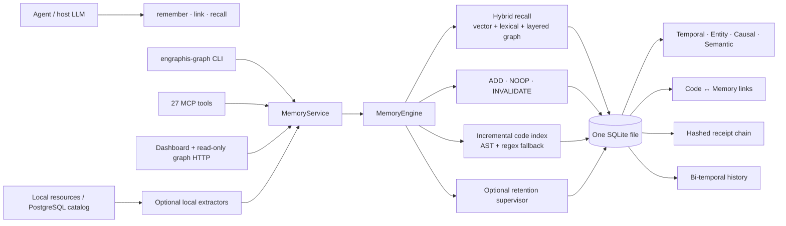

# Engraphis v3 architecture

This document is the design outline for the repo-graph, intent-native memory, resource-ingestion,
retention-supervision, and privacy-receipt additions introduced with schema version 3.



## Design outline

1. **One service contract.** MCP, REST, the dashboard, the CLI, and the read-only server call
   `MemoryService`; none implements independent memory semantics.
2. **One database, logical graph overlays.** `edges`, `mem_links`, and `code_edges` carry a
   `layer` tag (`temporal`, `entity`, `causal`, or `semantic`). Filters select overlays without
   creating separate stores.
3. **Structural and experiential knowledge stay normalized.** Code symbols remain in
   `symbols`/`code_edges`; memories remain in `memories`; `code_memory_links` connects them.
   Re-indexing can replace a changed file without copying memory text or losing history.
4. **Incremental code indexing.** `code_files` records content hashes. Unchanged files are
   skipped, changed files are transactionally replaced, deleted files are removed only after a
   complete scan, and bounded/truncated scans never delete unseen state.
5. **Offline community analysis.** Weighted label propagation identifies structural
   communities without adding an igraph/Leiden dependency to the core. Degree, cross-file degree,
   god-node flags, and surprising cross-file relationships feed impact analysis.
6. **Intent-native recall.** `intent_recall` maps cognitive intents such as `explain`,
   `summarize history`, and `locate code` onto layered graph traversal plus normal vector/lexical
   recall. Existing `engraphis_remember`, `engraphis_link`, and `engraphis_recall` remain the
   canonical MCP primitives, avoiding duplicate APIs.
7. **Local resource adapters.** Text, code, HTML, and DOCX use the standard library. PDF, image
   OCR, audio/video transcription, and PostgreSQL introspection are optional backends. Missing
   tools fail actionably; nothing uploads implicitly.
8. **Advisory retention supervision.** A host or configured LLM may classify a write as
   `ephemeral`, `normal`, or `critical`. The engine clamps importance/stability and records the
   decision; it never silently discards or hard-deletes a memory.
9. **Privacy-safe receipts.** Remember/link/recall and indexing operations append content-free,
   SHA-256-chained receipts. Raw memory/query text, workspace names, IDs, and actor identities are
   excluded from the exported payload.
10. **Team-safe exposure.** The full dashboard retains its existing auth/role controls. The
    optional `engraphis-graph-server` exposes only read operations and refuses a non-loopback bind
    without a bearer token.

## Schema additions

- Layer columns on `edges`, `mem_links`, and `code_edges`; durable rationale on `mem_links`.
- `code_files` for incremental indexing.
- `code_memory_links` for code/experience traversal.
- `operation_receipts` for the privacy-safe hash chain.
- `symbols.docstring` for extracted documentation.

Migration is additive and idempotent. Pre-v3 edge layers are inferred exactly once; explicitly
selected layers are never reclassified when a database is reopened.

## Repo workflow

```bash
engraphis-graph index -w acme -r api --root .
engraphis-graph search -w acme -r api "UserService"
engraphis-graph query -w acme -r api "where is token rotation implemented?"
engraphis-graph explain -w acme -r api "why does deploy depend on approval?"
engraphis-graph path -w acme -r api UserService DatabasePool
engraphis-graph impact -w acme -r api --root . --git-range origin/main...HEAD
engraphis-graph prs -w acme -r api --base main --head HEAD
engraphis-graph export -w acme -r api -o engraphis-graph-out
```

`export` writes `graph.json`, `graph.html`, and `GRAPH_REPORT.md`. A local union merge driver can
be installed with:

```bash
engraphis-graph install-merge-driver --root .
```

## Optional resource tools

```bash
pip install "engraphis[documents]"      # PDF + image OCR bindings
pip install "engraphis[transcription]"  # faster-whisper
pip install "engraphis[postgres]"       # psycopg
```

For transcription, set `ENGRAPHIS_WHISPER_MODEL` to a local model path or an explicitly chosen
model name. For PostgreSQL CLI ingestion, set `ENGRAPHIS_POSTGRES_DSN`; the value is never stored.
