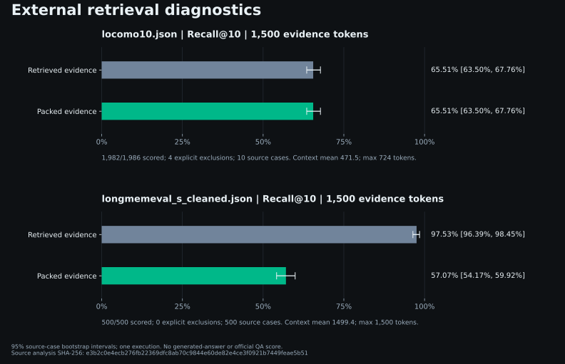
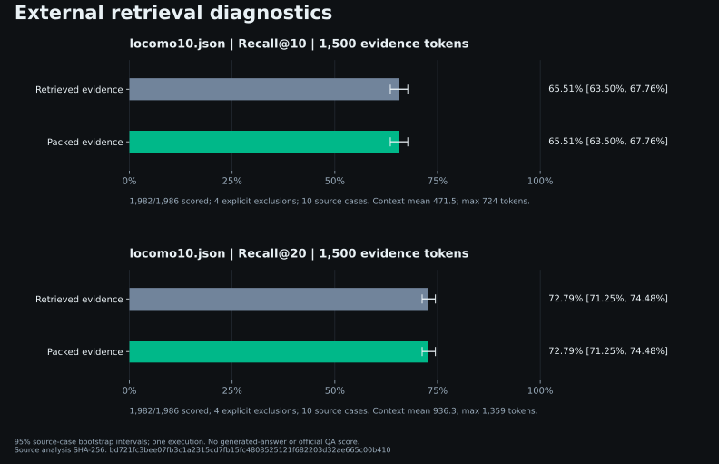
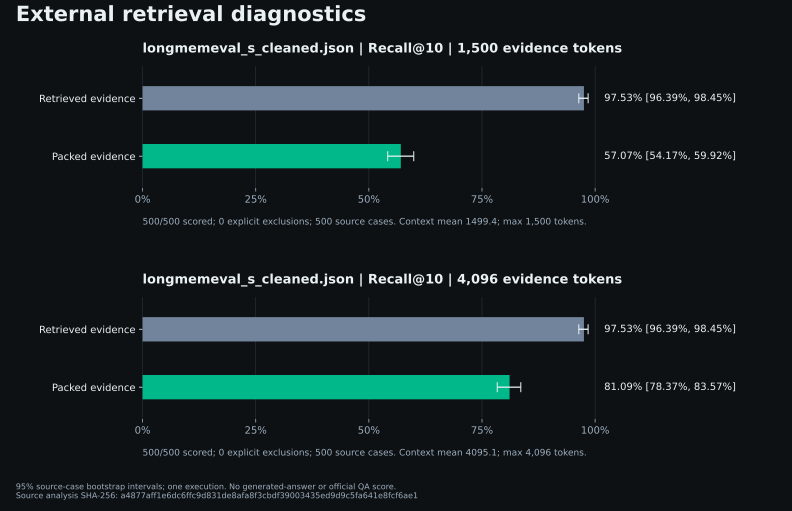
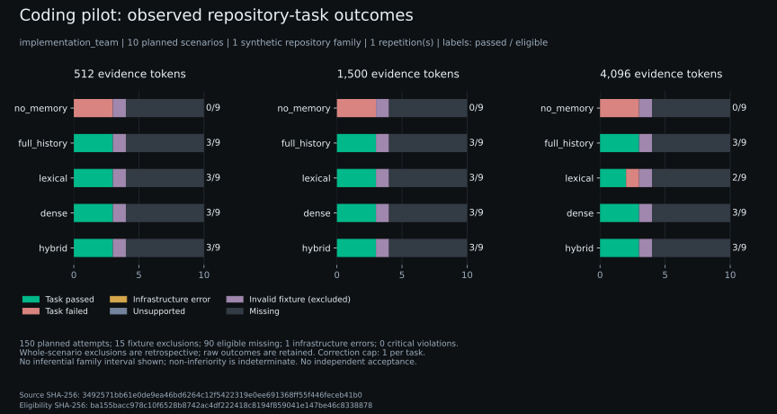

# Benchmark expansion: evidence and user workloads

Status: **PARTIAL**. The implementation, fixtures, adapters and local execution controls are
available for review. Completed measurements are distinguished from running or blocked work.
No merge, release, publication, paid model call or rented compute is implied by this document.

## Completed external measurements

The full LoCoMo retrieval diagnostic used all 10 conversations and 1,986 questions. The private
source-preparation ledger counted 5,882 ingested dialogue memories; that preparation count is not
carried as a metric in the public retrieval artifact. Of the questions, 1,982 have usable
retrieval labels and 1,538 have answer-token labels; the other denominators are retained
explicitly. The input used four declared annotation repairs/deduplications in the hash-bound v2
repair manifest; original source bytes were preserved.

| Measurement | Result | Boundary |
|---|---:|---|
| Retrieved evidence Recall@10 | 65.51% | Retrieval, not answer correctness |
| Packed evidence Recall@10 | 65.51% | Source IDs represented in the actual 1,500-token context |
| 95% source-conversation bootstrap interval | 63.50–67.76% | One execution; dataset sampling uncertainty |
| Retrieved evidence hit rate | 71.14% | At least one supporting source |
| Answer-token evidence coverage | 60.99% | Lexical evidence diagnostic, not generated-answer grading |
| Mean / maximum evidence context | 471.5 / 724 tokens | RegexTokenCounter estimate; excludes reader instructions and provider usage |

The score artifact is [locomo-full-20260916.json](benchmark-evidence/locomo-full-20260916.json),
with [derived analysis](benchmark-evidence/locomo-analysis-20260916.json) and checksum sidecars.
The full LongMemEval cleaned-S diagnostic also completed all 500 questions. Retrieved evidence
Recall@10 was **97.53%** (95% source-case interval **96.39–98.45%**), while packed evidence recall
was **57.07%** (**54.17–59.92%**). Mean context was 1,499.4 tokens, with a maximum of 1,500.
Answer-token coverage decreased from 80.14% in retrieved memories to 52.62% in packed excerpts
over 470 answer-scored questions. These remain lexical diagnostics, not generated-answer scores.

The source retained 500/500 retrieval-scored questions, omitted twelve declared empty non-answer
turns, and redacted 54 credential-shaped memory records before ingestion. Original source bytes
remain private and unchanged. The score is
[longmemeval-full-20260916.json](benchmark-evidence/longmemeval-full-20260916.json).
The [combined analysis](benchmark-evidence/external-baselines-20260916.json) validates underlying
record counts and derives the intervals. Timings from these runs are diagnostic; concurrent
development/test activity prevents treating them as isolated capacity measurements.

The figure is generated from the checksummed combined analysis:

No category was silently dropped. Category IDs 1 and 3 have lower evidence recall (37.75% and
30.41%) than IDs 2 and 4 (70.95% and 74.46%). These are diagnostic failure concentrations;
inspect the private retained question records before assigning a causal explanation. Category 5
is retained for evidence diagnostics and excluded from answer-token scoring as appropriate.

## Strengths, weaknesses and candidate configurations

| User workload | Evidence-supported strength | Limitation or observed weakness | Next bounded action |
|---|---|---|---|
| Recall from long conversation history | Increasing k from 10 to 20 raised packed recall from 65.51% to 72.79% at the same 1,500-token cap | Mean context roughly doubled; 27.21% of supporting evidence is still missing on average. Good compression does not prove correct answers | Try the measured opt-in configuration on similar workloads and validate task correctness before adopting it |
| Long sessions with temporal questions | LongMemEval retrieved evidence recall reached 97.53%; a 4,096-token budget retained 81.09% | At 1,500 tokens, packed recall was 57.07%; temporal-category recall fell from 96.06% retrieved to 45.12% packed | The measured larger budget improves evidence retention at roughly 2.73 times the context; validate reader correctness before adopting it |
| Short coding memories and context economy | Existing registered deterministic fixtures demonstrate smaller serialized payload and structure-aware document context | Historical 57.15% payload saving and current 53.88% use different payload measurements; neither is provider billing or task quality | Use compact responses for context economy when the required evidence is retained; test actual Smart/Classic wrapper results separately |
| Corrections, history and cross-session coding work | The executable corpus, real-engine journeys and native OAuth pilot exercise correction lineage, scope, handoff and abstention | The pilot uses one synthetic repository family. Its long-document oracle demanded hidden wording and is excluded across every arm; an interrupted call remains unscored | Complete eligible unattempted pilot cells within the existing allowance; repair the future corpus contract and validate across families before selecting a product change |
| Mixed documents, reimports, code-memory links | Seven executable journeys cover real v2 functional paths and preserve explicit measurement boundaries | Small fixtures do not establish throughput, multilingual quality, large-import reliability, or public leadership | Retain journey regressions; add observed customer-shaped failure cases to development data with provenance |
| Many memories and multiple agents | Both exact backend paths and the one-host capacity protocol are executable | Until the 24 cells finish, no 100k/16-process latency or throughput conclusion is supported. A second host is still required | Run fresh-process/database repetitions serially, inspect queue-inclusive tails, acknowledgement and erasure integrity before recommending a backend |
| Comparing memory products | Mem0 OSS and Graphiti have pinned local-store adapters and shared budgeted extraction routes | Adapter temporal/history/session limitations remain explicit; unsupported cells cannot establish product inferiority | Complete matched peer pilots and report preprocessing usage, supported subsets and missing attempts together |
| Finding memories relevant to a tool call | The Mem2ActBench small-set diagnostic retrieved 99.82% of labeled sources and packed 99.48% | Source-preparation metadata records 482 memory records across 380 retained cases and 20 source-data exclusions; those counts are not product metrics in the public run artifact. Expected tool-call token coverage was 41.03% after packing, and no action was executed | Treat this as a small evidence-coverage diagnostic; run the upstream action harness before claiming tool success |

The first measured improvement is an **opt-in retrieval-depth configuration** for this LoCoMo
diagnostic. Increasing k from 10 to 20 at the same 1,500-token cap raised retrieved and packed
evidence recall from **65.51% to 72.79%**, a paired difference of **+7.28 percentage points**
(95% source-conversation interval **+6.51 to +8.11**). Mean evidence context increased from
**471.5 to 936.3 tokens**, and maximum context from 724 to 1,359. Packed answer-token coverage
increased from 60.99% to 68.35%; generated-answer correctness remains unmeasured.

The [comparison artifact](benchmark-evidence/locomo-depth-comparison-20260916.json) binds both
complete runs and their configurations. Users with similar short conversation evidence can try
`MemoryEngine.recall(..., k=20, token_budget=1500)` when they can afford roughly twice the evidence
context, then check their own task outcomes. The benchmark used pinned MiniLM and `--no-resolve`
ingestion for annotated dialogues; that ingestion setting is not a general product recommendation.
This exploratory result neither changes defaults nor satisfies the coding holdout gate.

The second experiment increased LongMemEval's context ceiling from 1,500 to 4,096 tokens while
holding source, embedding and k=10 fixed. Across all 500 questions, retrieved recall stayed at
97.53%, while packed recall rose from 57.07% [54.17%, 59.92%] to 81.09% [78.37%, 83.57%], a
configuration difference of **+24.03 percentage points** [**+21.68, +26.24**]. Answer-token
coverage rose from 52.62% to 65.12%; mean packed context rose from 1,499.4 to 4,095.1 tokens,
with a 4,096-token maximum. This is one execution with source-case bootstrap uncertainty and no
model-repeat uncertainty. The [comparison artifact](benchmark-evidence/longmemeval-budget-comparison-20260916.json)
binds both reports. No production ranking/default patch is presented without task-level evidence.
The chart retains both budgets and their source-case intervals:

The changes already made fix measurement correctness, source reproducibility, budget recovery and
oracle isolation; they do not claim a product quality gain.

## Coding pilot validity and recovery

The original [OAuth pilot artifact](benchmark-evidence/core-pilot-oauth-v2-20260916.json)
retains 58 completed cells, one error and 91 missing cells from the declared 150. Its
[post-run integrity audit](benchmark-evidence/core-pilot-oauth-v2-integrity-20260916.json) joins 81 completed
reader/correction calls to native output and usage. One additional native call reached the
180-second deadline without a completed turn or usage record. Its reservation remains charged;
the call is not retried and its unknown usage is not represented as zero. All 81 completed
repository oracles returned normally, without a Docker timeout or nonzero exit.

The [corpus validity audit](benchmark-evidence/core-pilot-corpus-validity-20260916.json) found
that `long_documents` required an exact sentence absent from the supplied repository, task and
session evidence. Equivalent wording could fail the oracle. The retrospective
[eligibility mask](../eval/configs/benchmark-core-pilot-eligibility-20260916.json) excludes all
15 cells in that category, across all five arms and three budgets. Original corpus bytes,
raw results and the interrupted call remain unchanged and visible. This is a fixture defect,
so these failures cannot establish a weakness in any memory product. The other nine pilot
contracts expose their required values or return conventions.

There are 135 eligible cells: 45 completed in the original run and 90 unattempted. A continuation
may run only those unattempted eligible cells under the existing core-only allowance, with a
separately recorded 600-second transport deadline. It must retain the original error and bind
the parent checkpoints, ledger, eligibility audit and source revisions. Different transport
deadline cohorts cannot support an equivalent-latency comparison. The full raw experiment stays
`BLOCKED` while the original call's outcome is unknown, even if eligible execution completes.

The pilot's ten scenarios all belong to **one repository family**. Repeated arms and budgets
do not create independent repository samples; a clustered 95% quality interval is not estimable
and the one-percentage-point non-inferiority result is **indeterminate**. These are
`implementation_team` diagnostics, not independent-human acceptance. Citation support records
required-source-ID agreement, not independently judged entailment. The abstention field records
answer-presence agreement; it does not independently judge semantic refusal quality. Answer
completeness remains ungraded and answer-token overlap is a separate lexical diagnostic.

## Experiment status

| Declared experiment | Status | Evidence or unresolved work |
|---|---|---|
| Historical screenshot/release/current source mapping | COMPLETE | [Change coverage](BENCHMARK_CHANGE_COVERAGE.md); original artifacts unchanged |
| Full LoCoMo retrieval diagnostic | COMPLETE | 1,986 questions; 4 explicit retrieval exclusions; retained artifact and confidence analysis |
| Full LongMemEval retrieval diagnostic | COMPLETE | 500 questions; retained private checkpoints, public artifact and source-case intervals |
| Seven local user journeys | COMPLETE | [Checksummed journey artifact](benchmark-evidence/user-journeys-20260916.json); functional fixtures, not coding or capacity qualification |
| k=20 LoCoMo configuration experiment | COMPLETE | Same source, model and budget; +7.28 points packed recall with roughly doubled mean evidence context |
| LongMemEval 4,096-token context experiment | COMPLETE | Same-source 500-question comparison; packed recall 57.07% → 81.09% (+24.03 points), answer-token coverage 52.62% → 65.12%; retrieval-only and exploratory |
| NumPy / sqlite-vec capacity smokes | COMPLETE | Two serial four-process smoke cells, 100 scheduled operations each, zero observed correctness failures; hashing fixtures only |
| Coding core development pilot | BLOCKED | Original 58 complete / 1 error / 91 missing cells retained; 15 whole-scenario exclusions leave 135 eligible cells. Only the 90 unattempted eligible cells may continue; the original unknown call prevents a full completion claim |
| Mem0 OSS / Graphiti matched peer pilot | BLOCKED | Separate peer ingestion/reader budget required; local constructors/storage preflight only |
| Full coding development, validation and three-repeat holdout | BLOCKED | Corrected corpus validity, pilot, measured candidate selection and separate stage approvals must precede execution |
| Official LongMemEval-V2 pilot / 30-cell matrix | BLOCKED | Pinned harness CLI works; local GPU does not fit either prescribed model. [Compute proposal](LONGMEMEVAL_V2_FEASIBILITY.md) awaits approval; an OAuth judge path preserving GPT-5.2 is unqualified |
| MemoryAgentBench / LoCoMo-Plus | PARTIAL | MAB conflict-resolution (800 questions) and test-time-learning (700) retrieval diagnostics completed; two MAB splits and the Cognitive slice remain; see [diagnostic boundaries](ADDITIONAL_BENCHMARK_DIAGNOSTICS.md) |
| Mem2ActBench small retrieval diagnostic | COMPLETE | 380 retained cases completed; source-preparation metadata records 20 exclusions and 482 memory records; no tool execution or upstream action score |
| One-host capacity matrix | PARTIAL | 24 cells and 240,000 operations are frozen by the executable plan; execution completeness is separate from two-host qualification |
| Independent-human acceptance / leadership gates | BLOCKED | Implementation-authored synthetic evidence cannot satisfy these gates |

Execution commands, recovery rules, matched inputs and public-safe export boundaries are in
[BENCHMARK_EXPANSION_RUNBOOK.md](BENCHMARK_EXPANSION_RUNBOOK.md). Proposed hosted ceilings are
in [BENCHMARK_STAGE_BUDGETS.md](BENCHMARK_STAGE_BUDGETS.md). Status files and checkpoints are
authoritative for a running local queue; a queued command is not a completed experiment.

## Active local execution and validation

The [frozen local queue](../eval/configs/benchmark-local-queue-20260916.json) launched at
2026-09-16 03:04 UTC. At its final checkpoint (2026-09-16 04:06:59 UTC),
Mem2ActBench's 380 retained cases completed with no interrupted-case restarts; its
[public artifact](benchmark-evidence/mem2actbench-small-20260916.json) passed
schema and checksum validation. The LongMemEval 4,096-token comparison also completed and its
[comparison artifact](benchmark-evidence/longmemeval-budget-comparison-20260916.json) passed
schema and checksum validation. MAB conflict-resolution and test-time-learning also completed.
The queue then stopped between jobs because the OAuth implementation changed its source binding.
The [successor manifest](../eval/configs/benchmark-local-queue-final-v3-20260916.json) preserves those
five completions and contains only the four unfinished jobs. Its private execution status is
`.private-eval/benchmark-20260915/local-queue-final/status.json`; a prepared manifest is not a
completion claim. No hosted calls are included in either local queue.

The owner changed model authentication to **Codex OAuth only**. The inherited API gateway is
retired and no top-up of that gateway is needed for this runner. The
[OAuth preflight](benchmark-evidence/codex-oauth-preflight-20260916.json) retains two unscored
setup generations (4,907 input and 30 output tokens). The native app-server generation verified
Luna medium and usage; its first client check exposed a provenance-field mismatch, which was
fixed and covered by an offline integration regression. That failed check remains recorded and
was not retried. Subscription usage is explicitly distinct from the API-price proxy.

Full offline validation completed with **5,522 tests passed, 39 skipped, zero failures
and errors** in 635.6 seconds. Ruff, Pyright for the CI Linux target, commercial-boundary checks,
dashboard asset checks and all seven required offline evaluations also passed. Two suite warnings
were a dependency deprecation and an intentional malformed-ZIP fixture. Native Windows Pyright
has the pre-existing `os.register_at_fork` platform-stub limitation; the CI target reported zero
errors. Tests cover budget exhaustion, crash reservations, source drift, duplicate prevention,
model mismatch, OAuth-only routing, context overflow, redaction, adapters, isolated oracles,
queue heartbeats, watchdogs and capacity-summary validation. The first live pilot then exposed
a call-label integration defect before any reservation or provider dispatch. The fix prefixes
digest-based call IDs and also corrects public record identifiers; **63 focused tests** passed
after these two harness fixes, including real-ledger and artifact-envelope regressions. The
[failed attempt](benchmark-evidence/core-pilot-oauth-predispatch-failure-20260916.json) is retained
with zero provider dispatches. A subsequent process-tree timeout fix passed **23 focused queue
and capacity tests**, including a Windows launcher/child teardown regression. The full-suite
count above precedes these small harness fixes.
Earlier snapshots remain historical; the selected current deterministic fixture is v18.

These changes are on `codex/benchmark-expansion-20260915`, based on `ca790261`, with exact source
bytes retained in the manifests. They remain local for review. No production
ranking default, independent acceptance decision, merge, publication or product leadership
claim has been promoted.

The [validation snapshot](benchmark-evidence/campaign-validation-20260916.json) binds retained
test-log digests, the selected fixture, unchanged historical artifacts, completed evidence
artifacts and the active queue manifest. It contains no raw dataset text or provider output.
